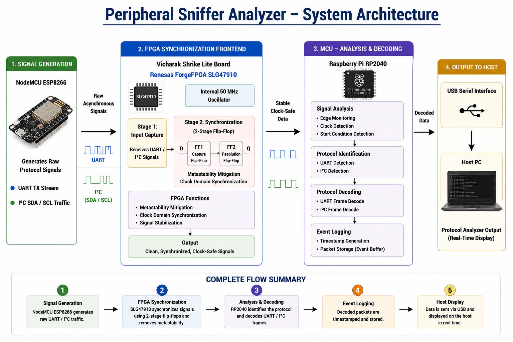

# Peripheral Sniffer Analyzer

---

## Overview

Peripheral Sniffer Analyzer is a hardware-assisted protocol monitoring and analysis system designed for reliable capture and decoding of digital communication protocols.

The system is built on the Vicharak Shrike Lite platform and combines a Renesas SLG47910 ForgeFPGA with a Raspberry Pi RP2040 microcontroller. The FPGA acts as a synchronization frontend, receiving asynchronous external signals and mitigating metastability through hardware-based synchronization before forwarding them to the MCU. This ensures that the RP2040 receives stable, clock-safe signals for accurate protocol analysis.

The RP2040 is responsible for protocol identification, frame decoding, packet processing, timestamp generation, event logging, and communication with a host computer through a USB serial interface.

The architecture separates signal conditioning from protocol processing, improving reliability when monitoring high-speed or asynchronous communication buses.

### Currently Supported Protocols

- **UART (Universal Asynchronous Receiver/Transmitter)**
  - Protocol detection
  - Frame decoding
  - Message reconstruction
  - Real-time monitoring

- **I²C (Inter-Integrated Circuit)**
  - Start condition detection
  - Clock pulse monitoring
  - Bus activity analysis
  - Frame decoding (under development)

### Future Protocol Support

- SPI (Serial Peripheral Interface)
- Automatic UART baud-rate detection
- Simultaneous multi-protocol monitoring
- Advanced packet logging and filtering
---

## Hardware

| Component | Purpose |
|------------|----------|
| Vicharak Shrike Lite | Development Platform |
| ESP8266 | Test Signal Generator |

---

## Architecture

  

---

## Build Instructions

### FPGA Bitstream Generation

1. Launch the **Renesas Go Configure Software Hub**.
2. Open the FPGA project located in the `fpga/rtl/` directory.
3. Configure the required I/O pin assignments using the IO Planner.
4. Verify clock and oscillator resource mappings.
5. Run the synthesis process.
6. Execute Place & Route (PnR).
7. Generate the FPGA bitstream.
8. Flash the generated bitstream to the SLG47910 ForgeFPGA.

### Firmware Deployment

1. Hold the **BOOTSEL** button on the Shrike Lite board.
2. Connect the board to the host computer via USB.
3. Release the BOOTSEL button.
4. Copy the generated `.uf2` file to the mounted `RPI-RP2` storage device.
5. The board will automatically reboot and start the firmware.

### Validation

After programming both the FPGA and RP2040:

1. Connect the host computer through USB.
2. Open a serial terminal (PuTTY, Tera Term, Minicom, etc.).
3. Configure the terminal for the selected baud rate.
4. Generate UART or I²C traffic from the external ESP8266.
5. Verify that protocol activity and decoded data are displayed on the host terminal.

---

### Pranjal Upadhyay

Indian Institute of Information Technology Design and Manufacturing, Kurnool

